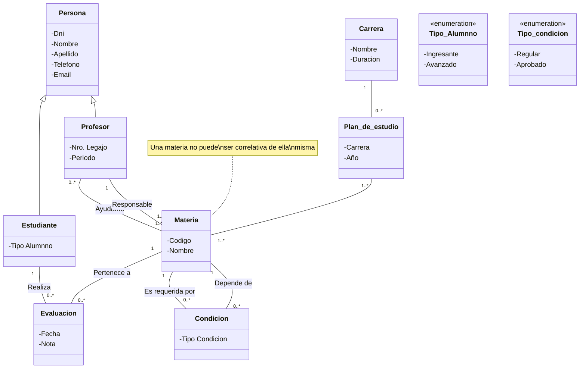

# Gestor académico
La institución educativa atraviesa problemas comunes ya que  los procesos administrativos y académicos se sostienen en planillas y sistemas antiguos que no se comunican entre sí.
La falta de integración genera demoras, inconsistencias y una dependencia muy fuerte de tareas manuales. Además, la comunicación entre docentes, estudiantes y personal administrativo se vuelve un desafío permanente, lo que muestra que no solo se trata de registrar información, sino también de garantizar accesibilidad y transparencia.
El nuevo sistema que se plantea tiene que centralizar toda la información en una plataforma única y confiable, de manera que cada actor pueda acceder a los datos que necesita según su rol. Uno de los puntos más importantes que surge del relato es el registro académico de los estudiantes: no solo almacenar datos personales y de contacto, sino también poder seguir de manera clara qué materias cursaron, qué aprobaron, en qué etapa de la carrera se encuentran y qué opciones de inscripción tienen disponibles. En este sentido, aparece como un problema crítico la validación de correlatividades, ya que actualmente los estudiantes muchas veces intentan anotarse en materias para las que no cumplen los requisitos, y no existe una forma automática de detectar esas situaciones. La institución no solo quiere guardar constancia de qué materias se cursaron, sino también de la calificación final obtenida en cada una. Esto contribuye a la trazabilidad del estudiante y se convierte en un insumo indispensable para el seguimiento de su rendimiento académico. Incluso se piensa en una herramienta de análisis más avanzada, capaz de detectar patrones de riesgo de abandono o de destacar a quienes tienen un desempeño sobresaliente.
En cuanto a los actores principales del sistema, se distinguen claramente tres. En primer lugar, la Oficina de Alumnos, que asumiría el rol de administrador. Este sector necesita acceso completo para dar de alta y gestionar la información de estudiantes, carreras, materias, docentes y correlatividades, además de supervisar los registros académicos. En segundo lugar están los estudiantes, que requieren una interfaz de consulta que les permita revisar su avance en la carrera, ver qué materias tienen disponibles para cursar según correlatividades y acceder a sus calificaciones. Por último, aparecen los docentes, que no solo deben poder consultar listados de alumnos, sino también registrar las notas y verificar en qué materias y con qué rol han sido designados.

## Diagrama de diseño

> [!IMPORTANT] Importante
> El siguiente grafico de mermaid no soporta la clase asociación como tal, por ende lo único que pude hacer es hacer una Reificación. Es decir crear directamente la entidad en el modelo. (Esto es solo un comentario.)

## Historias de usuario

| **ID de HU**                                         | HU-EST-001                                                                                                                                                                                                                                                                                                                                       |
| :--------------------------------------------------- | :----------------------------------------------------------------------------------------------------------------------------------------------------------------------------------------------------------------------------------------------------------------------------------------------------------------------------------------------- |
| **Titulo**                                           | Gestión de Estudiantes                                                                                                                                                                                                                                                                                                                           |
| **Declaración**                                      | Como personal de la Oficina de Alumnos, quiero registrar y administrar la información de los estudiantes, para poder llevar un control claro de sus datos personales y su avance académico.                                                                                                                                                      |
| **Descripción Detallada**                            | El sistema debe permitir:  -  Registrar estudiantes ingresantes y avanzados. - Guardar datos personales (DNI, nombre, apellido, dirección, contacto). - Consultar y actualizar información en cualquier momento. - Mantener un historial académico del estudiante (materias cursadas, correlatividades aprobadas, notas finales). |
| **Criterios de Validación(Criterios de aceptación)** | No se puede registrar un estudiante con un DNI duplicado. Al actualizar información de un estudiante, los cambios deben persistir y ser visibles inmediatamente. El sistema debe diferenciar entre estudiantes ingresantes y avanzados. Se debe poder consultar un historial académico completo por estudiante.                         |
| **Tareas Asociadas a la Implementación**             | Crear modelo de datos para “Estudiante”. Implementar validación de DNI único en la base de datos. Desarrollar interfaz de alta, modificación y consulta de estudiantes. Implementar consulta de historial académico por estudiante.                                                                                                     |

| **ID de HU**                                          | HU-MAT-001                                                                                                                                                                                                                                                                                    |
| :---------------------------------------------------- | :-------------------------------------------------------------------------------------------------------------------------------------------------------------------------------------------------------------------------------------------------------------------------------------------- |
| **Titulo**                                            | Gestión de Materias                                                                                                                                                                                                                                                                           |
| **Declaración**                                       | Como administrador del sistema, quiero gestionar la información de las materias, para poder organizar la oferta académica y mantener actualizados los planes de estudio.                                                                                                                      |
| **Descripción Detallada**                             | El sistema debe permitir: - Cargar y modificar materias de cada carrera. - Registrar código, nombre y plan de estudios al que pertenece cada materia. - Definir correlatividades entre materias.                                                                                     |
| **Criterios de Validación (Criterios de aceptación)** | No se puede registrar una materia con código duplicado. Al consultar una materia, se debe mostrar su plan de estudios y correlatividades. El sistema debe impedir inscripciones si no se cumplen las correlatividades. Se debe poder actualizar correlatividades de manera dinámica. |
| **Tareas Asociadas a la Implementación**              | Crear modelo de datos para “Materia” y “Correlatividad”. Implementar validación de código único para materias. Desarrollar interfaz para alta, modificación y consulta de materias. Programar lógica de validación de correlatividades en inscripciones.                             |

| **ID de HU**                                         | HU-CAR-001                                                                                                                                                                                                                                                                                             |
| :--------------------------------------------------- | :----------------------------------------------------------------------------------------------------------------------------------------------------------------------------------------------------------------------------------------------------------------------------------------------------- |
| **Titulo**                                           | Gestión de Carreras                                                                                                                                                                                                                                                                                    |
| **Declaración**                                      | Como administrador del sistema, quiero gestionar la información de las carreras, para poder organizar los planes de estudio y relacionarlos con sus materias correspondientes.                                                                                                                         |
| **Descripción Detallada**                            | El sistema debe permitir: - Cargar y modificar carreras ofrecidas por la institución. - Registrar nombre, código y plan de estudio de cada carrera. - Asociar cada carrera con su listado de materias. - Consultar carreras disponibles y sus planes vigentes.                             |
| **Criterios de Validación(Criterios de aceptación)** | No se puede registrar una carrera con código duplicado. Al consultar una carrera, se debe mostrar su listado de materias asociadas. Los cambios en el plan de estudios deben reflejarse en la oferta académica. El sistema debe permitir inactivar carreras antiguas sin perder su historial. |
| **Tareas Asociadas a la Implementación**             | Crear modelo de datos para “Carrera” y su relación con “Materia”. Implementar validación de código único de carrera. Desarrollar interfaz de alta, modificación y consulta de carreras. Implementar lógica de asociación entre carrera <--> materias.                                         |

## Requerimientos funcionales
- Gestión de Estudiantes 
- Gestión de Profesores 
- Gestión de Materias 
- Gestión de Carreras 
- Gestión de los Planes de Estudio 
- Gestión Progreso de los Estudiantes
## Requerimientos no funcionales
- El sistema debe centralizar la información en una única plataforma y reemplazar las planillas y sistemas previos no integrados.
- El sistema debe contar con una interfaz sencilla que facilite la comunicación y consulta de información para usuarios (administrativos, docentes y estudiantes).