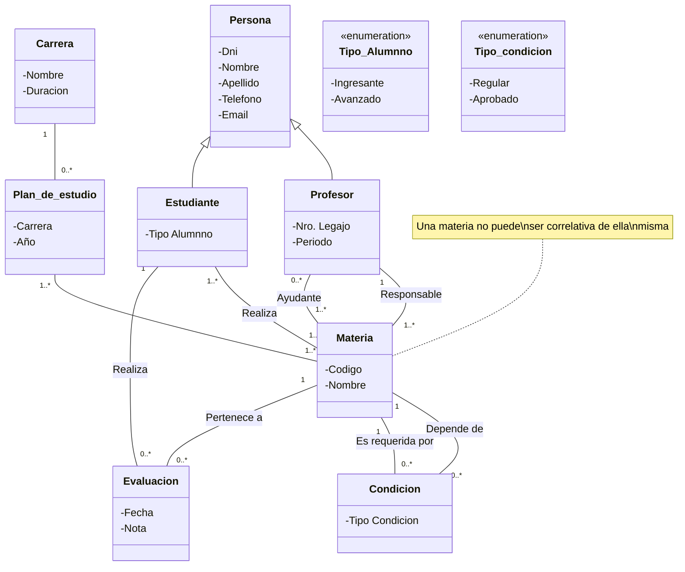
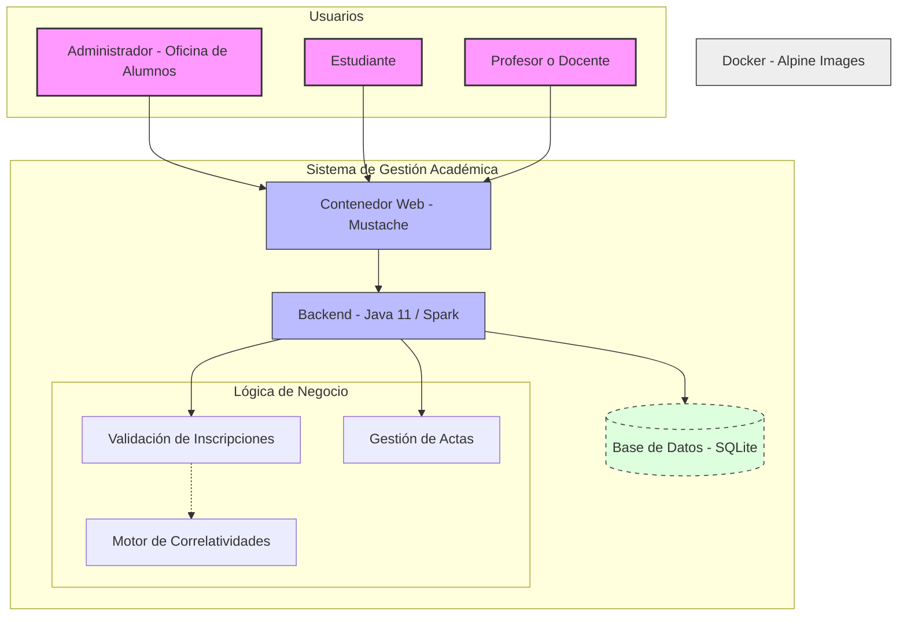

# SRS Software de Gestion académica

## **Problema que se quiere resolver**

La institución educativa enfrenta una desintegración de sus procesos académicos y administrativos, actualmente sostenidos por planillas y sistemas antiguos que no se comunican entre sí. Esta falta de integración provoca:

- **Ineficiencia Operativa:** Tareas manuales, demoras en la gestión y alta probabilidad de error en el registro de datos de estudiantes, profesores y oferta académica.
    
- **Falta de Trazabilidad:** Dificultad para llevar un control claro y centralizado del progreso académico de los estudiantes (materias cursadas, aprobadas, calificaciones).
    
- **Procesos no Automatizados:** La validación de correlatividades para la inscripción a materias se realiza de forma manual o no se realiza, generando conflictos e inscripciones incorrectas.
    
- **Comunicación Deficiente:** La información no es transparente ni de fácil acceso para los actores clave (alumnos, docentes, administrativos), lo que dificulta la toma de decisiones y la autogestión.
    

El objetivo central es **diseñar y construir un sistema único, centralizado y confiable** que resuelva estos problemas, automatizando los procesos clave y garantizando la accesibilidad y transparencia de la información para todos los roles involucrados.

---
## **Usuarios del sistema**

Se han identificado tres perfiles de usuario bien definidos:

1. **Administrador (Oficina de Alumnos):** Personal administrativo con acceso total al sistema para la gestión integral de la información. Sus funciones incluyen dar de alta y modificar datos de personas (estudiantes, docentes), gestionar la oferta académica (carreras, planes, materias, correlatividades) y supervisar los registros académicos.
    
2. **Estudiante:** Usuario final que interactúa con el sistema principalmente para consulta. Necesita visualizar su avance en la carrera, consultar su historial de calificaciones y conocer las materias disponibles para cursar en función de las correlatividades que ya ha aprobado.
    
3. **Profesor / Docente:** Usuario encargado de la gestión académica de sus cursos. Requiere consultar los listados de alumnos de las materias que dicta y, fundamentalmente, cargar las calificaciones (notas) de sus estudiantes en las actas correspondientes. También necesita visualizar su propia asignación horaria y de roles.

---

## **Funcionalidades principales**

Basado en los problemas a resolver y las necesidades de los usuarios, se identifican las siguientes funcionalidades principales del sistema:

1. **Gestión de Personas (ABMC):** Módulo para que el Administrador pueda crear, modificar, eliminar y consultar los datos personales y de contacto de Estudiantes y Profesores.
    
2. **Gestión de la Oferta Académica (ABMC):** Módulo para que el Administrador administre las carreras, los planes de estudio y las materias asociadas.
    
3. **Gestión de Correlatividades:** Herramienta para que el Administrador pueda definir y gestionar las relaciones de correlatividad entre materias (materias que son requisito para cursar otras).
    
4. **Inscripción a Materias con Validación Automática:** Proceso (automatizado en segundo plano) que, basado en el historial académico del estudiante y las correlatividades definidas, le presente un listado de materias a las que puede inscribirse. El sistema debe validar y rechazar automáticamente las inscripciones que no cumplan los requisitos.
    
5. **Gestión de Calificaciones (Actas):** Módulo para que el Profesor, en las materias que le fueron asignadas, pueda registrar las notas finales de los estudiantes. Esto debe quedar registrado en el historial del alumno.
    
6. **Consulta de Información Académica:**
    
    - Para **Estudiantes**: Visualización de su avance en la carrera (materias aprobadas con sus notas y materias por cursar).
        
    - Para **Profesores**: Visualización de los listados de alumnos de sus materias.
        
    - Para **Administradores**: Visualización de todo el progreso de cualquier estudiante.
        
7. **Asignación de Docentes a Materias:** Módulo para que el Administrador asigne a uno o varios profesores a una materia en un período académico específico, definiendo su rol (Responsable de Cátedra, JTP, Ayudante).
    
8. **Reportes y Seguimiento (Base para Futuro Análisis):** Módulo inicial de reportes que permita al Administrador visualizar el progreso de los estudiantes, identificando potenciales casos de bajo rendimiento o avance excepcional, sentando las bases para una futura herramienta de análisis predictivo. 

## **Requerimientos No Funcionales**

- **Usabilidad:** Debe contar con una interfaz sencilla e intuitiva para los tres tipos de usuarios (administrativos, docentes y estudiantes).
- **Trazabilidad:** El sistema debe mantener un registro histórico claro del rendimiento académico de los estudiantes (calificaciones, materias aprobadas, etc.).
- **Extensibilidad:** La plataforma debe estar preparada para, en un futuro, incorporar herramientas de análisis de datos para detectar patrones de riesgo o rendimiento sobresaliente.
- **Integridad y Consistencia de Datos:** Se debe garantizar la integridad referencial de los datos, especialmente en las relaciones críticas como correlatividades, inscripciones y calificaciones.
- **Trazabilidad Histórica:** El sistema debe mantener un registro inmutable del rendimiento académico de los estudiantes. Las calificaciones, una vez cargadas, no pueden eliminarse, solo auditables.
- **Seguridad por Roles:** El acceso a las funcionalidades y datos debe estar estrictamente controlado por los roles de usuario definidos (Administrador, Estudiante, Profesor). Cada actor debe poder acceder a la información que necesita según su rol, garantizando la transparencia de los datos académicos.
### **Restricciones técnicas**

- **Centralización Obligatoria:** El sistema debe ser la única fuente de verdad, reemplazando el uso de planillas y sistemas legacy desconectados.
- **Seguridad de Credenciales:** La información critica de los usuarios como las contraseñas deben estar cifradas con un tipo de cifrado simétrico.

---

## **Tamaño del equipo**

El que equipo esta compuesto por 5 integrantes.

---
## **Tecnologías elegidas y justificación**

### **Java 11 — Lenguaje de Programación**  
Se eligió Java por ser el estándar en sistemas académicos y empresariales, con tipado robusto, recolector de basura y un ecosistema maduro. Se utiliza la versión 11 para la compilación por su carácter LTS y compatibilidad con librerías modernas, mientras que el runtime es la versión 21 para aprovechar las mejoras de rendimiento, virtual threads y nuevas características del lenguaje. Es una elección sólida que garantiza escalabilidad y alineación con las prácticas de la industria.

### **Spark Framework 2.9.4 — Micro‑Framework Web**  
Spark se adoptó como alternativa ligera a Spring Boot, ideal para aplicaciones pequeñas o medianas gracias a su diseño minimalista tipo Sinatra (rutas definidas con `get()`, `post()`, filtros con `before()`). Se ajusta perfectamente a un sistema académico donde no se requiere la complejidad de Spring, permitiendo rapidez de desarrollo, baja sobrecarga y una curva de aprendizaje accesible.

### **ActiveJDBC 3.4** 
ActiveJDBC es un ORM basado en convenciones, no intrusivo, que trabaja con modelos POJO simples. A diferencia de JPA/Hibernate, es menos verboso y más performante en lecturas, evitando el overhead de un `EntityManager`. Se eligió por su pragmatismo: reduce el código repetitivo manteniendo la funcionalidad necesaria, lo que lo hace muy adecuado para un proyecto académico.

### **SQLite 3** 
SQLite se utilizó como base de datos embebida por su configuración cero y portabilidad (un único archivo `.db` que se incluye en el repositorio). Elimina la dependencia de un servidor externo (como MySQL o PostgreSQL), ideal para desarrollo y testing. Aunque en producción podría migrarse a PostgreSQL si se requiere mayor concurrencia, para un trabajo académico facilita la distribución y corrección sin complicaciones de infraestructura.

### **Mustache Templates — Motor de Templates**  
Mustache es un motor de plantillas “logic‑less” que opera con la misma sintaxis en múltiples plataformas (Java, JavaScript, Ruby, etc.). Se prefirió sobre Thymeleaf o JSP por su simplicidad: no requiere aprender una sintaxis compleja y separa claramente la lógica de negocio (Java) de la presentación (plantillas). Es una elección pragmática que enseña el concepto de plantillas sin agregar complejidad innecesaria.

### **JUnit 5 — Framework de Testing**  
JUnit 5 es el estándar de facto para pruebas en Java, aportando una arquitectura modular, soporte para pruebas parametrizadas, anidamiento y etiquetas. Se emplea para garantizar la calidad del código mediante pruebas unitarias y de integración, una práctica imprescindible en cualquier proyecto serio.

### **Docker  — Contenedorización**  
Se emplea Docker con imágenes base Alpine para lograr contenedores mínimos (~5 MB), rápidos de descargar y con un enfoque de seguridad. Se implementa un build multi‑stage que separa la construcción (con JDK completo) del entorno de ejecución (solo JRE), reduciendo aún más el tamaño final. Esta práctica garantiza reproducibilidad, despliegue consistente y acerca al proyecto a una metodología industrial imprescindible.

---

## **Plazo estimado**

-

---

## **Problemas encontrados**

- 

---

## **Forma de organización del equipo**

El equipo se organiza de una manera rotativa siempre manteniendo la siguiente estructura;
- 3 **Desarrolladores Backend**
- 1 **Desarrollador Frontend**
- 1 **Tester**
---
## **Análisis de riesgos**

[[AnalisisDeRiesgoIA]].

---

## **Diagrama de Diseño**

---
## **Diagrama de arquitectura**

